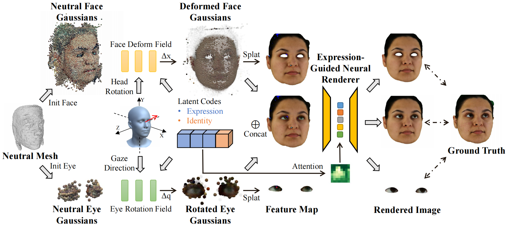

# GazeGaussian: High-Fidelity Gaze Redirection with 3D Gaussian Splatting

> [Project Page](https://ucwxb.github.io/GazeGaussian/)  
> [Xiaobao Wei](https://ucwxb.github.io/), [Peng Chen](https://chenvoid.github.io/), Guangyu Li, [Ming Lu](https://lu-m13.github.io/), Hui Chen $^\dagger$ , Feng Tian  
> ICCV2025 Highlight Paper  
> $\dagger$ Corresponding author



Gaze estimation encounters generalization challenges when dealing with out-of-distribution data. To address this problem, recent methods use neural radiance fields (NeRF) to generate augmented data. However, existing methods based on NeRF are computationally expensive and lack facial details. 3D Gaussian Splatting (3DGS) has become the prevailing representation of neural fields. While 3DGS has been extensively examined in head avatars, it faces challenges with accurate gaze control and generalization across different subjects. In this work, we propose GazeGaussian, a high-fidelity gaze redirection method that uses a two-stream 3DGS model to represent the face and eye regions separately. By leveraging the unstructured nature of 3DGS, we develop a novel eye representation for rigid eye rotation based on the target gaze direction. To enhance synthesis generalization across various subjects, we integrate an expression-conditional module to guide the neural renderer. Comprehensive experiments show that GazeGaussian outperforms existing methods in rendering speed, gaze redirection accuracy, and facial synthesis across multiple datasets. We also demonstrate that existing gaze estimation methods can leverage GazeGaussian to improve their generalization performance. The code will be released.

## News
- **[2025/7/27]** Code v1.0 is released.  
- **[2025/6/26]** GazeGaussian is accepted as ICCV2025 Highlight! Code will be released soon.

### Environmental Setups
We recommend using conda for the installation of dependencies. Please enter the following command step by step for preparing the environment.

```bash
git clone https://github.com/ucwxb/GazeGaussian
cd GazeGaussian
conda env create -f env.yaml
conda activate gazegaussian

# The conda environment is python 3.8, cuda 11.6, torch 1.12.0
pip install --no-index --no-cache-dir pytorch3d -f https://dl.fbaipublicfiles.com/pytorch3d/packaging/wheels/py38_cu116_pyt1120/download.html
pip install kaolin==0.13.0 -f https://nvidia-kaolin.s3.us-east-2.amazonaws.com/torch-1.12.0_cu116.html

# for submodules
cd submodules/diff-gaussian-rasterization
pip install -e .

cd ../..
cd submodules/simple-knn
pip install -e .
```

### Preparing Dataset
The dataset preprocess mainly follows [GazeNeRF](https://github.com/AlessandroRuzzi/GazeNeRF). For convenience, we have uploaded the processed data to [Hugging Face](https://huggingface.co/ucwxb/GazeGaussian/). Please follow the instructions below to download the processed data, required files, and pretrained GazeGaussian checkpoint.
```bash
mkdir data
cd data
# For ETH-XGaze Training set
wget https://huggingface.co/ucwxb/GazeGaussian/resolve/main/ETH-XGaze.zip.partaa
wget https://huggingface.co/ucwxb/GazeGaussian/resolve/main/ETH-XGaze.zip.partab
wget https://huggingface.co/ucwxb/GazeGaussian/resolve/main/ETH-XGaze.zip.partac
wget https://huggingface.co/ucwxb/GazeGaussian/resolve/main/ETH-XGaze.zip.partad
wget https://huggingface.co/ucwxb/GazeGaussian/resolve/main/ETH-XGaze.zip.partae
wget https://huggingface.co/ucwxb/GazeGaussian/resolve/main/ETH-XGaze.zip.partaf
wget https://huggingface.co/ucwxb/GazeGaussian/resolve/main/ETH-XGaze.zip.partag
wget https://huggingface.co/ucwxb/GazeGaussian/resolve/main/ETH-XGaze.zip.partah
wget https://huggingface.co/ucwxb/GazeGaussian/resolve/main/ETH-XGaze.zip.partai
wget https://huggingface.co/ucwxb/GazeGaussian/resolve/main/ETH-XGaze.zip.partaj
wget https://huggingface.co/ucwxb/GazeGaussian/resolve/main/ETH-XGaze.zip.partak
wget https://huggingface.co/ucwxb/GazeGaussian/resolve/main/ETH-XGaze.zip.partal
wget https://huggingface.co/ucwxb/GazeGaussian/resolve/main/ETH-XGaze.zip.partam
wget https://huggingface.co/ucwxb/GazeGaussian/resolve/main/ETH-XGaze.zip.partan
cat ETH-XGaze.zip.part* > ETH-XGaze.zip
unzip ETH-XGaze.zip

# For ETH-XGaze test set
wget https://huggingface.co/ucwxb/GazeGaussian/resolve/main/ETH-XGaze_test.zip
unzip ETH-XGaze_test.zip

# For cross-dataset evaluation on ColumbiaGaze, MPIIFaceGaze, gazecapture
wget https://huggingface.co/ucwxb/GazeGaussian/resolve/main/ColumbiaGaze.zip
wget https://huggingface.co/ucwxb/GazeGaussian/resolve/main/MPIIFaceGaze.zip
wget https://huggingface.co/ucwxb/GazeGaussian/resolve/main/gazecapture.zip
unzip ColumbiaGaze.zip MPIIFaceGaze.zip gazecapture.zip

# For required files
cd ../configs
wget https://huggingface.co/ucwxb/GazeGaussian/resolve/main/config_models.zip
unzip config_models.zip

# For pretrained GazeGaussian checkpoint
cd ../checkpoint
wget https://huggingface.co/ucwxb/GazeGaussian/resolve/main/gazegaussian_ckp.pth
```

### Directory Structure
After downloading and extracting all files, your project structure should look like this:

```
GazeGaussian/
├── data/
│   ├── ETH-XGaze/                    # Training dataset
│   │   ├── xgaze_subject0000.h5
│   │   └── ...
│   ├── ETH-XGaze_test/               # Test dataset
│   │   ├── xgaze_subject0012.h5
│   │   └── ...
│   ├── ColumbiaGaze/                 # Cross-dataset evaluation
│   ├── MPIIFaceGaze/                 # Cross-dataset evaluation
│   └── gazecapture/                  # Cross-dataset evaluation
├── configs/
│   ├── config_models/                # Required model configurations
│   │   └── ...
├── checkpoint/
│   └── gazegaussian_ckp.pth          # Pretrained GazeGaussian checkpoint
└── README.md
```

### Training
The training of GazeGaussian includes 2 steps: 1. Pretrain a canonical mesh head, 2. Train the main pipeline. The scripts for these two steps have been put into the "scrips/train" folder. You can directly run the following command. 
```bash
# For mesh head
bash scripts/train/train_meshhead.sh <GPU_ID>
# After training, the pretrained checkpoint will be saved in the "work_dirs/meshhead/checkpoints" folder

# For GazeGaussian pipeline
bash scripts/train/train_gazegaussian.sh <GPU_ID>
# This script loads the pretrained GazeGaussian checkpoint by default. 
# Please modify the `load_meshhead_checkpoint` parameter to load a pretrained mesh head and train GazeGaussian from "scratch".
```
- `<GPU_ID>`: Specifies the index of the GPU to use.


## Acknowledgments
Our code is based on [GazeNeRF](https://github.com/AlessandroRuzzi/GazeNeRF) and [Gaussian Head Avatar](https://github.com/YuelangX/Gaussian-Head-Avatar). 

Thanks to these excellent open-sourced repos!

## Citation

If you find our work useful for your research, please consider citing:

```bibtex
@inproceedings{wei2025gazegaussian,
  title={GazeGaussian: High-Fidelity Gaze Redirection with 3D Gaussian Splatting},
  author  = {Wei, Xiaobao and Chen, Peng and Li, Guangyu and Lu, Ming and Chen, Hui and Tian, Feng},
  booktitle={Proceedings of the IEEE/CVF international conference on computer vision},
  year={2025}
}

```
